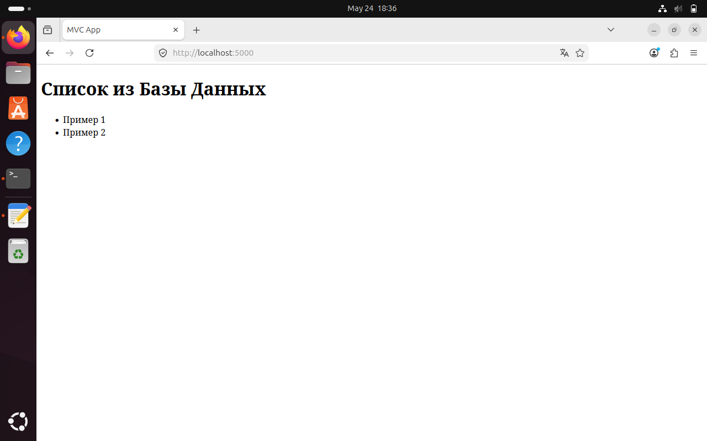

## Лабораторная работа по работе с docker
Работа посвящена изучению технологии работы с контейнерами.


## Часть I. Docker

```
docker build -t flask-app .

[+] Building 50.7s (10/10) FINISHED                              docker:default
 => [internal] load build definition from Dockerfile                       0.1s
 => => transferring dockerfile: 199B                                       0.0s
 => [internal] load metadata for docker.io/library/python:3.9-slim         2.1s
 => [internal] load .dockerignore                                          0.0s
 => => transferring context: 2B                                            0.0s
 => [1/5] FROM docker.io/library/python:3.9-slim@sha256:2d97f6910b16bd338  4.8s
 => => resolve docker.io/library/python:3.9-slim@sha256:2d97f6910b16bd338  0.0s
 => => sha256:ea56f685404adf81680322f152d2cfec62115b30dda481c 251B / 251B  0.2s
 => => sha256:fc74430849022d13b0d44b8969a953f842f59c6e9 13.88MB / 13.88MB  1.1s
 => => sha256:b3ec39b36ae8c03a3e09854de4ec4aa08381dfed84a 1.29MB / 1.29MB  1.1s
 => => sha256:38513bd7256313495cdd83b3b0915a633cfa475dc 29.78MB / 29.78MB  3.4s
 => => extracting sha256:38513bd7256313495cdd83b3b0915a633cfa475dc2a07072  0.7s
 => => extracting sha256:b3ec39b36ae8c03a3e09854de4ec4aa08381dfed84a9daa0  0.1s
 => => extracting sha256:fc74430849022d13b0d44b8969a953f842f59c6e9d1a0c2c  0.4s
 => => extracting sha256:ea56f685404adf81680322f152d2cfec62115b30dda481c2  0.0s
 => [internal] load build context                                          0.1s
 => => transferring context: 1.91kB                                        0.0s
 => [2/5] WORKDIR /app                                                     0.2s
 => [3/5] COPY requirements.txt .                                          0.1s
 => [4/5] RUN pip install --no-cache-dir -r requirements.txt              39.0s
 => [5/5] COPY . .                                                         0.1s 
 => exporting to image                                                     4.3s 
 => => exporting layers                                                    3.6s
 => => exporting manifest sha256:f7fc38fa5124527e7f038aeec01744e03dfccd20  0.0s
 => => exporting config sha256:368edb0f3e5efa4dc3257beeba1403a2bf01527bb7  0.0s
 => => exporting attestation manifest sha256:3cfba400f89b815a434c231b5947  0.0s
 => => exporting manifest list sha256:3e6ed46f8d532b16a0d70aaed7326ffa683  0.0s
 => => naming to docker.io/library/flask-app:latest                        0.0s
 => => unpacking to docker.io/library/flask-app:latest                     0.6s
```

```
docker run -d --name flask-container -p 5000:5000 flask-app
66a3b6d64e07580d9f1b912535e47e8bdd0b8dd253e6d3dea63a62dd55e88479

docker ps
CONTAINER ID   IMAGE       COMMAND           CREATED          STATUS          PORTS                                         NAMES
66a3b6d64e07   flask-app   "python app.py"   11 seconds ago   Up 11 seconds   0.0.0.0:5000->5000/tcp, [::]:5000->5000/tcp   flask-container
```

```
echo "# Flask Docker App" > README.md

docker cp README.md flask-container:/home/README.md
Successfully copied 19B (transferred 2.05kB) to flask-container:/home/README.md
```
```
docker exec -it flask-container /bin/bash
root@66a3b6d64e07:/app# ls -la /home
total 12
drwxr-xr-x 1 root root 4096 May 23 18:32 .
drwxr-xr-x 1 root root 4096 May 23 18:32 ..
-rw-rw-r-- 1 1000  984   19 May 23 18:32 README.md
root@66a3b6d64e07:/app# cat /home/README.md
# Flask Docker App
```
```
root@66a3b6d64e07:/app# exit
exit

docker stop flask-container
flask-container
```
## Часть II. Docker compose
```
docker compose up -d
 
[+] up 12/14
 ⠸ Image mysql:8.0 [⣿⣿⣿⣿⣿⣿⣿⣿⣿⣿⣿⣿⣿] 246.5MB / 248.2MB Pulling               19.4s
[+] Building 2.1s (12/12) FINISHED                                              
 => [internal] load local bake definitions                                 0.0s
 => => reading from stdin 480B                                             0.0s
 => [internal] load build definition from Dockerfile                       0.0s
 => => transferring dockerfile: 199B                                       0.0s
 => [internal] load metadata for docker.io/library/python:3.9-slim         1.2s
 => [internal] load .dockerignore                                          0.0s
 => => transferring context: 2B                                            0.0s
 => [1/5] FROM docker.io/library/python:3.9-slim@sha256:2d97f6910b16bd338  0.0s
 => => resolve docker.io/library/python:3.9-slim@sha256:2d97f6910b16bd338  0.0s
 => [internal] load build context                                          0.0s
 => => transferring context: 248B                                          0.0s
 => CACHED [2/5] WORKDIR /app                                              0.0s
 => CACHED [3/5] COPY requirements.txt .                                   0.0s
 => CACHED [4/5] RUN pip install --no-cache-dir -r requirements.txt        0.0s
 => [5/5] COPY . .                                                         0.3s
 => exporting to image                                                     0.2s
 => => exporting layers                                                    0.1s
 => => exporting manifest sha256:76db809c3cda7ad818ee08e074203c463372ce36  0.0s
 => => exporting config sha256:48ddab3e049e50538ffa417c52fabd140fdc85a2de  0.0s
 => => exporting attestation manifest sha256:f976934333dc84da04949998ec9d  0.0s
 => => exporting manifest list sha256:65be76c3ace138ac5b01534fbce1f9bfad5  0.0s
 => => naming to docker.io/library/lab8-web:latest                         0.0s
[+] up 18/18king to docker.io/library/lab8-web:latest                      0.0s
 ✔ Image mysql:8.0      Pulled                                             19.4s
 ✔ Image lab8-web       Built                                               2.1s
 ✔ Network lab8_default Created                                             0.1s
 ✔ Container mysql-db   Healthy                                            30.9s
 ✔ Container flask-web  Started                                            31.0s
```

```
docker compose ps

NAME        IMAGE       COMMAND                  SERVICE   CREATED         STATUS                   PORTS
flask-web   lab8-web    "python app.py"          web       2 minutes ago   Up About a minute        0.0.0.0:5000->5000/tcp, [::]:5000->5000/tcp
mysql-db    mysql:8.0   "docker-entrypoint.s…"   db        2 minutes ago   Up 2 minutes (healthy)   0.0.0.0:3306->3306/tcp, [::]:3306->3306/tcp, 33060/tcp
```

```
docker compose logs web

flask-web  |  * Serving Flask app 'app'
flask-web  |  * Debug mode: off
flask-web  | WARNING: This is a development server. Do not use it in a production deployment. Use a production WSGI server instead.
flask-web  |  * Running on all addresses (0.0.0.0)
flask-web  |  * Running on http://127.0.0.1:5000
flask-web  |  * Running on http://172.18.0.3:5000
flask-web  | Press CTRL+C to quit
```

```
curl http://localhost:5000

<!DOCTYPE html>
<html>
<head>
    <title>MVC App</title>
</head>
<body>
    <h1>Список из Базы Данных</h1>
    <ul>
        
            <li>Пример 1</li>
        
            <li>Пример 2</li>
        
    </ul>
</body>
</html>
```

